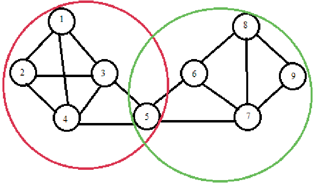

# 0. Course Project

For my course project, I will be taking a look at the project [Increasing Bike Share Efficiency](https://www.informs.org/Impact/O.R.-Analytics-Success-Stories/Increasing-Bike-Share-Efficiency) on the *Informs* website. This project tackles the problem of finding the most efficient way to distribute bikes in a bike sharing system.

# 1. Introduction: Bike Sharing and The Bike Rebalancing Problem

Before I discuss the project methodology, I want to provide some context to the problem statement. What are bike sharing systems and what do they have to do with the problem statement?

## 1.1 Bike Sharing Systems

Bike sharing systems are public transportation systems that have been adopted by many cities. They have become a popular transportation option in many cities because they provide a sustainable and convenient method of transportation.

There are two different categories of bike sharing systems: dock-based systems and free-floating services. In line with the original project being discussed, we will focus only on dock-based systems. Dock-based systems require users to pick up and drop off bikes at stations which are located at certain areas within the city. Each station has a set number of docks.

This means capacity of each station is limited to the number of docks at the station.

For example, upon arrival, a user ending their trip may find that all the docks at a station are full; they will be forced to travel further to find a station to drop off their bike, incuring a longer travel time and higher costs. Or in another case, a user intending to start a trip may find the docks at a station are empty, forcing them to find another station or use another means of transport.

## 1.2 The Bike Rebalancing Problem

The dynamic nature of the system creates situations where bike shortages occur in locations with high demand, while bike surpluses accumulate in locations with low demand. Bike sharing companies then need to figure out a way to move the surplus of bikes back to the stations with shortages. This is known as the Bike Rebalancing Problem.

A common and short term strategy is to use vehicles to transport bikes from one station to another. To ensure there are as many usable bikes as possible, bikes are usually transported only short distances during the day, and longer distances at night. However, the labour cost to transport bikes by vehicles can be costly.

Recently, some companies have adopted crowd sourced rebalancing, where users are prompted to move a bike from one station to another in exchange for a reward[^1].

[^1]: Daniel Chemla, Fr´ed´eric Meunier, Thomas Pradeau, Roberto Wolfler Calvo, Houssame Yahiaoui. Self-service bike sharing systems: simulation, repositioning, pricing. 2013.

All bike sharing systems (dock-based or dockless) rely on some sort of rebalancing operations to maintain the usability of such systems and limit the inabilities to use a station, either for the pick-up or drop-off of bicycles.

Many studies over the years have proposed different ways to solve this problem. There are approaches that range from optimizing station location, bike transport routes, and fleet size (number of bikes in the system).

# 2. What This Project Is About

## 2.1 Original Solution

Referring back to the project, we see that the researchers involved in this project developed a novel solution. Their solution is in two parts:

1.  They optimized the allocation of docks at stations, and
2.  Used an incentive scheme to crowd source rebalancing.

The article did not go into detail on the approach used by the researchers on this project. It is also not the purpose of this course project to discuss the researchers' approach. Instead, I will be proposing a methodology that I believe could be used to solve the problem in the article.

## 2.2 Problem Statement(s)

Before I talk about my methodology, let's define the problem statement that we want to solve. Since the original article provided two parts to the solution, I will provide two problem statements, one for each part of the solution.

Based on my understanding of the article, here is how I would define the problem statements:

1.  How can we best allocate docks in the bike sharing system in order to minimize the time users have to spend waiting for a free dock or bike?
2.  How do we choose the best reward scheme to incentivise users to help us rebalance bikes?

## 2.3 Proposed Methodology

Below, I will describe my methodology to approach the problem statements.

**Problem Statement #1:** **How can we best allocate docks in the bike sharing system in order to minimize the time users have to spend waiting for a free dock or bike?**

Problem Statement #1 will be solved using an optimization model. Since a bike sharing system can be modeled as a closed-network queuing system[^2], this optimization model will be based on queuing theory.

[^2]: Li, QL., Fan, RN., Ma, JY. (2016). A Unified Framework for Analyzing Closed Queueing Networks in Bike Sharing Systems.

In order to obtain the information we need for the optimization model, we will first use an ARIMA model to predict the demand at each station, and the Louvain algorithm to determine interconnected stations. Then we will apply the results of these two models to the optimization model to find the best way to allocate docks for an efficient bike sharing system.

**Problem Statement #2**: **How do we choose the best reward scheme to incentivise users to help us rebalance bikes?**

Problem Statement #2 will be solved with a multi-armed bandit algorithm, with consideration given to full factorial testing as well.

For this methodolgy, there are some assumptions that follow:

1.  Assume that we can increase or decrease the number of docks as needed, up to 2 times the number of bikes in the system[^3].
2.  Assume our solution is meant to remain in the long term (more than a year). The solution is specifically focused on allocating docks to stations, unlike standard rebalancing efforts which involves moving the bikes. Docks are not as easily moved as bikes are, so we assume that this is intended to be a more permanent solution with little change.

[^3]: <https://brtguide.itdp.org/branch/master/guide/bicycle-and-pedicab-integration/bicycle-systems#service-area-and-phasing/station-size>

Finally, there are some things that this methodology will not address. Optimizing the location of stations is not within our scope, nor is optimizing the fleet size. Improving the efficiency of bike share systems is a complex problem, and we will only be working with one part of it – optimizing the allocation of docks at each station – in order to stay true to the original problem given in the article.

Throughout the paper, we will be taking a closer look at the analytics models chosen, as well as the advantages and disadvantages of each model

# 3. Optimization of Dock Allocation

## 3.1 Time-Series Modeling: Predicting Demand At Stations

Knowing the demand of bikes at each station is an important part of our optimization model. Bike demand changes over time, so I'd like to use a time-series model to predict it.

### 3.1.1 Data

Here are some types of data that should be considered for this model:

-   Start and Endpoint Data: Start and endpoint data includes data such as the starting or ending station, time and date.

-   Subscription or Membership type: Bike sharing companies often offer subscriptions to users that provide benefits such as discounted rates for certain distances, or times of the day. User behavior differs based on the presence and type of subscription.

I believe these types of data should be fairly readily available for analysis as it would come from logs of bike trips that bike sharing companies record every time a user rents a bike.

Based on past experience, the data that I require is in line with the data that bike sharing companies record[^4].

[^4]: eg. Lyft's Baywheel system data: <https://www.lyft.com/bikes/bay-wheels/system-data>

However, these are automatically logged data by machines and we should expect missing data or outliers in cases where there are outages. Also, public bikes can be involved in accidents or thefts which may also interfere with accurate data collection.

### 3.1.2 Model Selection

The time-series model I have chosen to work with is ARIMA.

First, we would like to predict observations and not variance. Of the three time-series models we learnt in the course, GARCH is not an option.

Next, the goal of this project was established to be a more long-term and permanent goal. Between exponential smoothing and ARIMA, ARIMA is more suited to predict for the longer-term because ARIMA forecasts on stationary data.

Bike demand is non-stationary data (i.e., the demand follows trends and seasonality). The benefit of ARIMA is that even though it only forecasts on stationary data, it can take non-stationary data as input and transform it into stationary data before forecasting. It does this by modeling the differences between observations which are stationary, rather than the non-stationary observations itself.

(As a note, it's possible to test if data is stationary or non-stationary. In the case that data is truly stationary, we can still use an ARIMA(p,0,q) model where the order of differencing is 0 and no differencing is done. ARIMA is a very flexible model and we will not be forced to use another model if our assumption isn't true.)

For added certainty, we can also try different time-series models, such as exponential smoothing, ARIMA models with different *p, d,* or *q* values, or even different ARIMA models such as ARMA or SARIMA models, before performing cross-validation on them to determine the best model using AIC or BIC as metrics.

The outcome of this ARIMA model should be the predicted demand for every time interval (eg. every hour or every day).

### 3.1.3 Model Evaluation

The key downside of using time-series forecasting for this project is that most time-series models do not do very well at forecasting very long-term time-series. The further into the future we are trying to predict, the larger the error terms will be.

Even though ARIMA is better than exponential smoothing at long-term forecasting, it still has this pitfall. With the understanding that the allocation of docks is meant to be a long-term solution, I would suggest re-running the model every six months to year or so to monitor the demand of bikes since the last time.

Alternatively, we can build a more complex model by combining ARIMA with boosting methods[^5] or neural networks[^6] in order to forecast further into the future.

[^5]: <https://otexts.com/fpp2/bootstrap.html>

[^6]: <https://otexts.com/fpp2/nnetar.html>

## 3.2 Communities in Graphs: Identifying Interconnected Stations

I am including this section because I think that interconnected stations will be an important constraint in the later optimization model.

If we consider every station as a node, and travel routes between stations as the edges, we can construct a transportation network of the bike sharing system in a city to understand human mobility patterns.

Interconnected communities in this network are groups of bike sharing stations that people frequently travel between. For example, a bike sharing station at an office building and a bike sharing station at a nearby train station would be considered interconnected stations; people who work at the office building will travel between these two bike-sharing stations daily. In the morning, there would be a high demand of bikes from the train station and a high supply of bikes at the office building. In the evening, it would be the opposite. Traffic between interconnected stations is related: an increase in supply of bikes to one interconnected station is due to the increase of demand of bikes at another interconnected station.

Therefore it's logical to assume that if we increase the number of docks at one of these interconnected stations, we should also increase the number of docks at the other interconnected stations.

### 3.2.1 Data

To find the interconnected stations, we will need the following data:

-   Station details (eg. name, ID)

-   Travel routes and frequency of trips between stations which can be derived by tracking how each bike ID moves between stations (eg. A bike travelling from Station A to Station B creates an edge between A and B)

Similar to reasoning made in 3.1.1, I believe the data for this section should also be quite readily available, or at least easily derived from the data that we have.

### 3.2.2 Model Selection

To effectively model the movement between nodes, we will be using a modularity-based clustering algorithm.

Since we consider stations our nodes or data points, we can't use distance-based clustering like K-Means. A distaince-based algorithm would just map the distance between stations whereas we're trying to model the movement, or connection, within the stations. Thus modularity-based clustering is more well suited for our needs.

We can use the Louvain algorithm to create communities based on modularity. Further we can create a weighted graph, which means edges are assigned weights to indicate the strength of connection between nodes. Higher frequency of trips between nodes will represent a high weightage. This way, stations that have a lot of movement between them will be more strongly considered as a community.

The outcome of this algorithm should give us clusters of interconnected stations which users travel frequently between.

### 3.2.3 Model Evaluation

An important benefit of the Louvain algorithm is that it is a heuristic, which means it produces near-optimal solutions in a short amount of time. This is good because a bike sharing systems can have a lot of data. Using a heuristic means that less time and resources will be spent on this intermediate step, while still giving us good quality results.

The main downside of the Louvain algorithm is that it's not very good at mapping overlapping communities. It produces only non-overlapping communities, which means that each node can belong to at most one community. This is usually not representative of real-world situations.

For example in Figure 1, bikes may be arriving to the office building (node 5) from not one but two train stations (nodes 3 and 6), but not between the two train stations themselves. These are two distinct communities that have overlapped on the office building that may be treated as a single cluster by the Louvain algorithm. We don't want this because that would suggest we distribute docks between the single cluster equally when instead we should place a twice as many docks at node 5 as we do at nodes 3 and 6.

One possible algorithm that does better with overlapping communities is the Leiden algorithm. But generally algorithms that can detect overlapping communities are a lot more complex. For our optimization model, this quick heuristic will do. I recommend that the results be supplemented by some human investigation before being used in the model.

## 3.3 Queue Optimization: Optimizing Allocation of Docks At Stations

Having modeled bike demand using an ARIMA model and human mobility patterns with the Louvain algorithm, we can move on to optimize the allocation of docks according to queuing theory.

Our optimization problem aims to minimize the total cost of service and waiting by finding the balance between bike demand and bike supply (number of docks) at stations.

### 3.3.1 Data

Here are some types of data to be considered for this optimization problem:

-   Expected arrival rate of customers at each station: This is the output from the ARIMA model in 3.1.[

-   Interconnected stations: This is the output from the Louvain algorithm in 3.2.

-   Station ID of all stations

-   Cost of installing or removing docks including time, transport, manpower and manufacturing/disposal.

-   Number of docks currently at each station

### 3.3.2 Constructing the Optimization Problem

Following queuing theory, the objective function of our optimization problem should consider the arrival rate of customers, service rate, cost of service and cost of waiting.

We also need to take into considerations the constraints of the problem. First, we need to stay within the budget of the project. Next, as discussed in 3,2, interconnected stations will be a constraint. Increasing the number of docks at once station will should mean an increase in the number of docks for the other interconnected stations as well due to the constant traffic between them. Third would be the limit on how many docks can be at one station. Docks and docked bikes take up space, but each station has a finite amount of space around it that will limit the number of docks that can be allocated to that station. Finally, mentioned in 2.3, we will want to limit the number of docks to at most 2x the number of bikes. This is a more specific constraint on cost – we don't want to oversupply on docks.

The outcome of our optimization model should help us find the the number of docks to be placed at each bike sharing station where the queue time is minimized, given data such as the location of each station, the time and distance between each stations, the cost of re-allocation of docks, and the outputs of our previous two models.

### 3.3.3 Model Evaluation

Given the long-term limitations of our initial ARIMA model, we should also re-run this optimization model at the same time we re-run the ARIMA model. This will enable us to monitor any changes in the solution since the last run.

However we may not always want to take action every time the solution changes - re-allocation of docks may be costly and if action is taken too often, it may cost more than the money it generates. Propose we set up a threshold, so that when it goes over a certain threshold, we can be confident that re-allocation will be effective and the profit earned from it will outstrip the cost of re-allocation.

This brings us to the end of the first part of our solution.

# 4. Experiment Design: Incentivizing Crowd Sourced Rebalancing

For the second part of the solution, we introduce crowd sourced rebalancing: in crowd sourced rebalancing, volunteers help to move a bike from a pick-up station to a nearby drop-off station and are rewarded. Generally, volunteers are prompted through a system (like a bike sharing app) to move a bike from a specific station to another specific station. If carried out properly, rebalancing through this strategy can be done at a very low cost to the company.

## 4.1 Multi-Armed Bandit Algorithm

For a company trying to implement crowd sourced rebalancing for the first time, there would probably some experimentation to find the reward that will best motivate volunteers. Here are some factors that could have been considered:

-   Type of rewards: What types of rewards are users motivated by? (eg. Cash balance, discounts on future trips, redeemable points)

-   Pricing schemes: How much does the reward have to be before a volunteer is willing to move a bike? Should it be a fixed value per bike moved or dynamic pricing?

-   Location of pick-up/drop-off stations: How far are volunteers willing to go to drop off a bike?

### 4.1.1 Data 

And data to be collected from each experiment:

-   Number of bikes moved: This can be tracked through the number of completed tasks or number of rewarded users

-   Pick-up/drop-off stations for each bike and distances between those stations

-   User feedback, such as satisfaction rating for the reward scheme

The data I anticipate to be the most difficult to obtain in this experiment would be the user feedback. While the other data points are probably logged in the system, user feedback is usually more of an optional field in such experiments. Over the course of the experiment there will probably be some users who participate in crowd sourced rebalancing but don't respond to the feedback survey. Non-response may be acceptable if the sample is representative of the population. However, if we find that only users of a certain characteristic (eg. station ID, membership type) are responding, we should try to increase our response rate in those areas to round out our feedback.

### 4.1.2 Experiment Process

We can combine different to create a number of solutions. These solutions can be rolled out on the bike sharing app, and the number and type of successful rebalancings recorded for each solution. Then we can conduct an experiment to arrive at the best solution.

Since there are multiple factors, we can consider between a factorial design experiment and a multi-armed bandit algorithm.

A factorial design experiment allocates an equal sample size to each option to test all possible variations. It gathers data on all possible variations before presenting the final winner. With a multi-armed bandit algorithm, a solution is presented after every iteration, usually in real time. A multi-armed bandit algorithm is also designed to maximize gain/minimize loss during the experiment, while simultaneously collecting data to perform hypothesis testing.

Due to its ability to maximize the gains of the experiment, I believe the multi-armed bandit algorithm would be better than a factorial design experiment. Assigning equal samples to a lower performing solution like a factorial design experiment means the company is missing out on potential volunteers that could be helping to rebalance bikes, which means a potential loss of customers and business opportunities at a nearby station.

# 5. Conclusion

In summary, here are the steps we took to increase the efficiency of bike sharing systems.

For Problem Statement #1: Optimizing the allocation of docks at stations:

1.  Given bike trip records of start and endpoint data such as station and time, use an ARIMA model to predict demand at each station.
2.  Given routes and frequency of trips between each station, use the Louvain algorithm to identify interconnected stations weighted by frequency of trips.
3.  Given the output of the earlier two models along with the available resources (company budget, fleet size, number of stations), use an optimization program according to queuing theory to optimize the allocation of docks with the goal of minimizing total service cost against waiting cost.

For Problem Statement #2: Incentivizing crowd sourced rebalancing:

1.  Given potential solutions created by combining different factors, use a greedy multi-armed bandit experiment to pick to solution that will drive the most number of volunteers for rebalancing.

Most of the data required for this project should be readily available from bike sharing app data, such as information about bike ID, end and start time/station of trips, etc. Other data should also be readily available on the company's end (eg. station IDs, cost of installing docks). The only data I really expect to have difficulty collecting is from the customer surveys for the multi-armed bandit algorithm.

A key point of concern I had throughout this project was trying to reduce bias related to station locations. As we covered in class, location data in the US can be easily correlated to demographic data such as race or income which may lead to bias in the analysis. I believe modeling with station location data in this case is not an issue as we are not making decisions based on location itself, but the number of bikes or expected traffic associated with the station.

Another thing that I think should be a consideration is the possibility that our optimization model might over-optimize, for example a solution be optimal in terms of cost but suggest that 0 docks be allocated to some stations on the edge of the city where traffic is low. This is good for our budget, but not so good for the people in that area who may rely on the bikes for transport. We might want to set a further constraint on the optimization problem so that each station must have a minimum number of docks. But the point is that sometimes the effect a service has on people can't be as easily quantified as cost or profit, but should also be equally important considerations in analytics, especially when we are analyzing something that people depend on, like public transport, or electricity.
