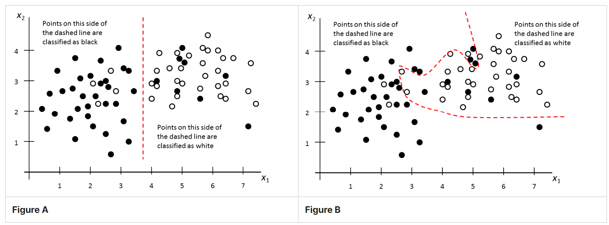
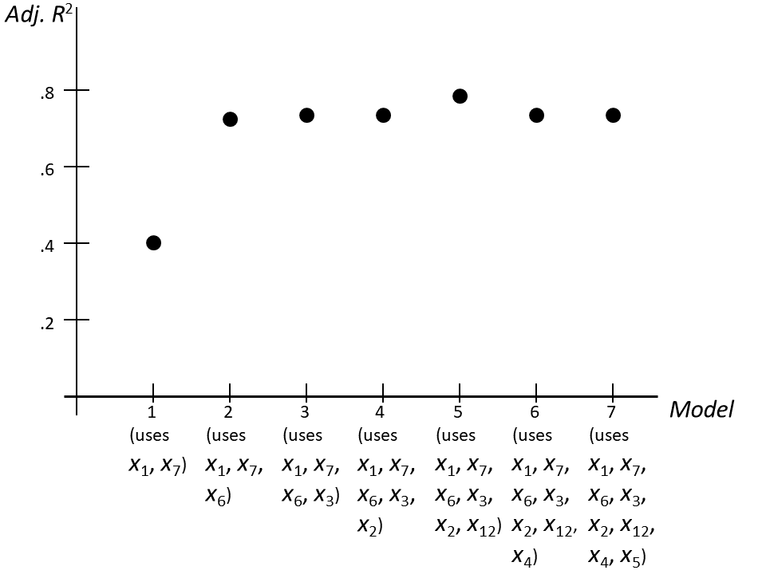
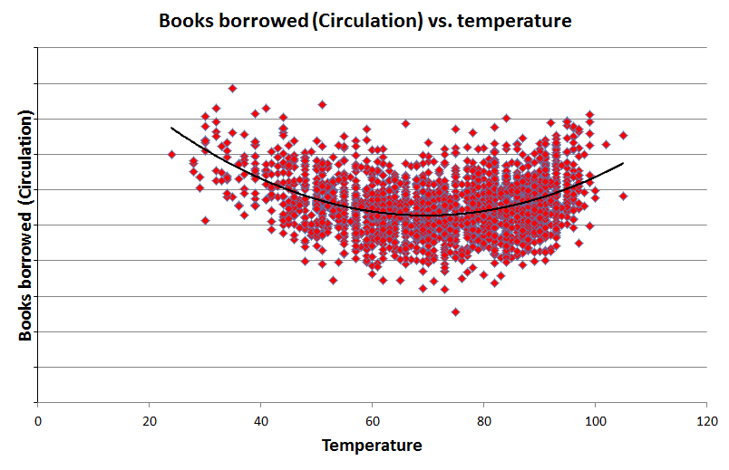
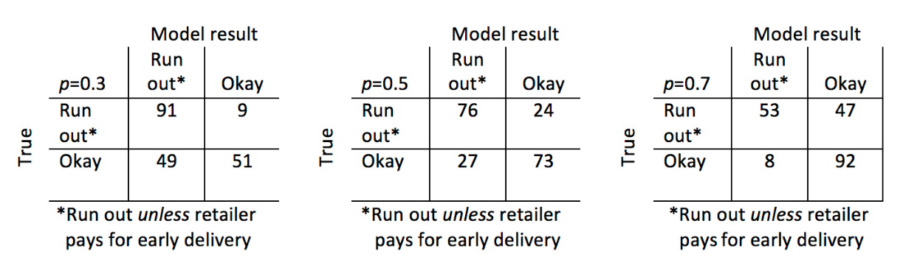
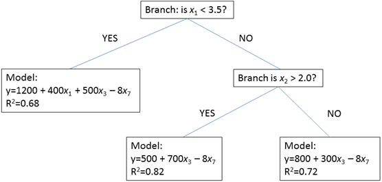

**Question 1:** Drag each of the 13 models/methods to one of the 5 categories of question it is commonly used for, unless no correct category is listed for it. For Models/methods that have more than one correct category, choose any one correct category; for models/methods that have no correct category listed, do not drag them.

**Answer:**

-   Classification: CART, K-Nearest-Neighbour, Logistic Regression, Random Forest, Support Vector Machine

-   Clustering: K-Means

-   Response Prediction: ARIMA, Exponential Smoothing, Linear Regression

-   Validation: Cross-Validation

-   Variance Estimation: GARCH

------------------------------------------------------------------------

**Question 2:** Select all of the following models that are designed for use with attribute/feature data (i.e., not time-series data):

**Answer:**

-   [x] K-Nearest-Neighbour

-   [x] Support Vector Machine

-   [x] Random Forest

-   [ ] GARCH

-   [x] Logistic Regression

-   [x] Principal Component Analysis

-   [ ] Exponential Smoothing

-   [x] Linear Regression

-   [ ] CUSUM

-   [ ] ARIMA

-   [x] K-Means

------------------------------------------------------------------------

**Information for Question 3a, 3b, 3c**

Figures A and B show the training data for a soft classification problem, using two predictors (x~1~ and x~2~ ) to separate between black and white points. The dashed lines are the classifiers found using SVM. Figure A uses a linear kernel, and Figure B uses a nonlinear kernel that required fitting 16 parameter values.

**Question 3a:** Select all of the following statements that are true.

**Answer:**

-   [ ] Figure A's classifier is based only on the value of $x_{2}$.

-   [ ] Figure A's classifier is more likely to be over-fit than Figure B's classifier.

-   [x] Figure A's classifier has a wider margin than Figure B's classifier in the training data.

-   [x] Figure A's classifier incorrectly classifies exactly 4 white points as black in the training data.

-   [ ] Figure A shows that the black point (7.2, 1.4) is an outlier.

**Question 3b:** Select all of the following statements that are true.

**Answer:**

-   [x] Figure B's classifier has a narrower margin in the training data than Figure A's classifier.

-   [x] Figure B's classifier is more likely to be over-fit than Figure A's classifier.

-   [ ] Figure B's classifier incorrectly classifies exactly 5 white points in the training data.

-   [ ] Figure B shows that the black point (7.2, 1.4) is colored incorrectly; it should actually be white.

**Question 3c:** Select all of the following statements that are true.

**Answer:**

-   [ ] A new point at (3, 3) would be classified as white by Figure A's classifier.
-   [x] A new point at (3,3) would be classified as white by Figure B's classifier.
-   [ ] A new point at (3, 3) would be classified as white by a K-Nearest-Neighbour algorithm for $5 \le k \le 10$.
-   [x] In Figure A, if the training data had 1000 more white points to the right of the classifier, a 1000-nearest-neighbour algorithm would classify a new point at (3,3) as white.

**Question 3d:** In the soft classification SVM model where we select coefficients $a_{0} ... a_{m}$ to minimize $$\sum_{j=1}^n max{0,1 - (\sum_{i=1}^m a_{i}x_{ij} + a_{0}) y_{i}}+C\sum_{i=1}^m a_{i}^2$$ Select all of the following statements that are correct.

**Answer:**

-   [x] Decreasing the value of $C$ could decrease the margin.

-   [x] Requiring a larger margin could increase the number of classification errors in the training set.

-   [ ] Increasing the value of $C$ could decrease the number of classification errors in the training set.

**Question 3e:** In the hard classification SVM model, it might be desirable to put the classifier in a location that has equal margin on both sides... (select all correct answers):

**Answer:**

-   [ ] ...even though moving the classifier will usually result in fewer classification errors in the validation data.

-   [ ] ...even through moving the classifier will usually result in fewer classification errors in the test data.

-   [x] ...when the costs of misclassifying the two types of points are very similar

------------------------------------------------------------------------

**Information for Questions 4a, 4b, 4c**

Seven different regression models have been fitted, using different sets of variables. The figure below shows the resulting adjusted R-squared value for various models, as measured by cross-validation.

**Question 4a:** Which of the models would you expect to perform best on a test data set?

**Answer:**

-   [ ] Model 5, because it has the highest Adjusted $R^2$.

-   [ ] Model 1, because it has a much lower Adjusted $R^2$.

-   [ ] Model 4, because its Adjusted $R^2$ is only slightly lower than Model 5 and uses one fewer predictor.

-   [x] One of the Models 2,3,4,5,6,7 but it's hard to be sure which because their Adjusted $R^2$ are so close to each other.

**Question 4b:** Under which of the following conditions would Model 3 be the most appropriate to use (select all correct answers)?

**Answer:**

-   [ ] Data collection for $x_{6}$ is too expensive for it to be used in the model.

-   [ ] Government regulations require using $x_{2}$ for this sort of model.

-   [x] It is important to find the simplest good model that includes $x_{3}$.

-   [ ] The value of $x_{3}$ is not known in time for use in the model.

**Additional Information for Question 4c**

The table below shows the Akaike Information Criterion (AIC), Corrected AIC, and Bayesian Information Criterion (BIC) for each of the models.

|       |       |               |       |
|:-----:|:-----:|:-------------:|:-----:|
| Model |  AIC  | Corrected AIC |  BIC  |
|   1   | -5.58 |     -5.32     | 2.07  |
|   2   | -5.67 |     -5.15     | 3.89  |
|   3   | -6.51 |     -5.62     | 4.96  |
|   4   | -4.77 |     -3.41     | 8.61  |
|   5   | -2.80 |     -0.85     | 12.49 |
|   6   | -1.31 |     1.35      | 15.90 |
|   7   | 0.19  |     3.71      | 19.31 |

**Question 4c:** Based on the table above and the figure shown for Question 4a, select all of the following statements that are correct.

**Answer:**

-   [ ] BIC suggests that Model 1 is very likely to be better than Model 2.

-   [ ] Among Models 3 and 4, AIC suggests that Model 3 is $e^{(-6.51-(-4.77))/2} = 41.9$% as likely as Model 4 to be better.

-   [x] Among Models 3 and 4, AIC suggests that Model 4 is $e^{(-6.51-(-4.77))/2} = 41.9$% as likely as Model 3 to be better.

-   [x] Adjusted $R^2$ (see figure above 4a) and BIC (see table above 4c) both agree that Model 5 might be a little better than Model 6.

------------------------------------------------------------------------

**Information for all parts of Question 5**

Atlanta's main library has collected the following day-by-day over the past six years (more than 2000 data points):

$x_{1}$ = Number of books borrowed from the library on that day

$x_{2}$ = Day of the week

$x_{3}$ = Temperature

$x_{4}$ = Amount of rainfall

$x_{5}$ = Whether the library was closed that day

$x_{6}$ = Whether public schools were open that day

**Question 5a:** Select all data that are binary:

**Answer:**

-   [ ] Number of books borrowed from the library on that day

-   [ ] Day of the week

-   [ ] Temperature

-   [ ] Amount of rainfall

-   [x] Whether the library was closed that day

-   [x] Whether public schools were open that day

**Question 5b and 5c**

The library believes that when there were more online searches of the library catalog yesterday, more books will be borrowed today(and fewer searches yesterday means fewer boos borrowed today), so they add a new predictor:

$x_{7}$ = number of online searches of the library catalog the day before

**Question 5b:** If the library is correct that on average, if there were more online searches of the library catalog yesterday, more books will be borrowed today (and fewer searches yesterday means fewer books borrowed today), what sign (positive or negative) would you expect the new predictor's coefficient $a_{7}$ to have?

**Answer:**

-   [ ] Positive, because the response (books borrowed today) is a positive number
-   [x] Positive, because higher values of $x_{7}$ increase the response (books borrowed today.
-   [ ] Negative, because higher values of $x_{7}$ decrease the response (books borrowed today).

**Question 5c:** Does $x_{7}$ make the model autoregressive?

**Answer:**

-   [ ] Yes, because the model uses both day $t-1$ search data and day $t$ rainfall data as predictors.

-   [ ] Yes, because the model uses day $t-1$ data to predict date $t$ circulation.

-   [x] No, because the model does not use previous response data to predict the day $t$ response.

**Information for Question 5d**

The library believes that as the temperature gets either too cold or too hot , more people come indoors to the library to borrow books, They have fit the data to a quadratic function (see figure below).

**Question 5d:** How would you incorporate the new information above into the library's regression model?

**Answer:**

-   [x] Add a $(temperature)^2$ variable to the model.

-   [ ] Replace the temperature variable with a $(temperature)^2$ variable in the model.

-   [ ] Change the model to estimate the square root of the books borrowed, as a function of temperature, day of the week, inches of rainfall, whether the day is a holiday, and whether schools were open.

**Question 5e-i,ii**

The library has built a triple exponential smoothing (Holt-Winters) model of the number of books borrowed each day, using a multiplicative weekly cycle of seasonality (i.e., $L=7$).

**Question 5e-i:** Every year on July 4, the library shoots off fireworks in its parking lot, so nobody is allowed to borrow books that day. The model only has a weekly seasonality, not an annual one. Is the model more likely to over-predict or under-predict books borrowed on July 4?

**Answer:**

-   [x] Over-predict

-   [ ] Under-predict

-   [ ] Neither

**Question 5e-ii:** Is the model likely to over-predict or under-predict books borrowed on July 5? (Assume the library is open and allows borrowing on July 5).

**Answer:**

-   [ ] Over-predict
-   [x] Under-predict
-   [ ] Neither

**Question 5-eiii:** Aside from seasonal and trend effects, the library believes that the random variation in books borrowed each day is small. Should they expect the best value of $\alpha$ (the baseline smoothing constant) to be:

**Answer:**

-   [ ] $\alpha < 0$

-   [ ] $0 < \alpha < 1/2$

-   [x] $1/2 < \alpha < 1$

-   [ ] $\alpha > 1$

**Information for Questions 5f, 5g, 5h**

The library would like to compare the regression and exponential smoothing models to determine which is a better predictor, using the mean absolute error \|(books borrowed) - (model's estimate)\| / n as a measure of prediction quality.

**Question 5f:** Select the best of the following four options for splitting the data:

**Answer:**

-   [ ] 70% for cross-validation and test, 30% for training

-   [ ] 70% for training, 30% for a cross-validation and test

-   [x] 70% for training and cross-validation, 30% for test

-   [ ] 70% for training and test, 30% for cross-validation

**Question 5g:** Match each data set with its purpose. Drag the purpose next to the appropriate data set.

-   Test Set: Estimate quality of selected model

-   Training Set: Fit parameters of all models

-   Validation Set: Compare all models & select best

**Question 5h:** The person who build these models discovered that although the exponential smoothing model performed well on the training set, it performed much worse on the validation set:

|                             | Mean Absolute Error (Training Set) | Mean Absolute Error (Validation Set) |
|---------------------|-------------------------|--------------------------|
| Regression Model            | 130                                | 139                                  |
| Exponential Smoothing Model | 128                                | 167                                  |

Select all of the reasonable suggestions below:

**Answer:**

-   [x] The regression model is probably better, because it does much better on the validation set.

-   [ ] The exponential smooting model is probably fit too much to random patterns (i.e., it is overfit), because it performs much worse than the regression model on the validation set.

-   [ ] To choose between the models, we should see which one does better on the test set.

-   [x] If there had been 20 models, the one that performed best on the validation set would probably not perform as well on the test set as it did on the validation set.

**Question 5i:** Fewer books are borrowed on Fridays than any other day. The library would like to determine whether there has been a change in the Friday effect on borrowing, over the past 40 years. Select all of the approaches that might reasonable be correct.

**Answer:**

-   [x] Use CUSUM on the number of additional books borrowed on the average Friday compared to the average other day for each year over the past 40 years.

-   [x] Use exponential smoothing (with $L=7$) to find the seasonal multiplier values $C_{t}$ for each Friday, and use CUSUM on those values.

-   [x] Build a regression model for each of the 40 years, and use CUSUM on the coefficients of the Friday variable.

------------------------------------------------------------------------

**Information for Questions 6a, 6b**

A logistic regression model was build to model the probability that a retailer's inventory was built to model the probability that a retailer's inventory of a popular product will run out before the next delivery from the manufacturer, based on a number of factors (amount of current inventory, past demand, promotions, etc.).

If the logistic regression's output is greater than a threshold value $p$, the retailer pays an additional amount $D$ for a quick delivery to avoid running out.

These are the three confusion matrices below, for three different threshold values of $p$:

**Question 6a:** Let $D$ be the cost of paying for a quick delivery (if the model's output is above $p$). Let $C$ be the cost of running out of inventory. Select all of the statements that are correct:

**Answer:**

-   [ ] When $p=0.7$, the total cost is $(53D + 47D + 8C)$.

-   [x] When $p=0.7$, the total cost is $(53D + 47C + 8D)$.

-   [x] The fewest extra deliveries are made when $p=0.7$.

**Question 6b:** The retailer's primary goal right now is to build its market share, so it estimates the cost $C$ of running out to be 10 times worse than the cost $D$ of paying for an early delivery (i.e., $C = 10D$). which threshold value of $p$ would you suggest?

**Answer:**

-   [ ] $p=0.7$

-   [ ] $p=0.5$

-   [x] $p=0.3$

------------------------------------------------------------------------

**Question 7:** The figures below each show a data set that will be used in k-means clustering algorithms (where distance between values is important).

Each data set has two attributes. For each data set, drag to it the data preparations that are needed for k-means for work well on the data set.

**Answer:**

-   Attribute 1: 0-10, Attribute 2: 0-10 plus one value at 1000: Only outlier removal

-   Attribute 1: 0-10, Attribute 2: 0-10: Neither outlier removal nor scaling

-   Attribute 1: 0-10, Attribute 2: 0-1000: Only scaling

-   Attribute 1: 0-1000, Attribute 2: 0-10 plus one value at 1000: First outlier removal and then scaling

-   Unused: First scaling and then outlier removal

------------------------------------------------------------------------

**Information for Questions 8a, 8b**

A regression tree approach was used to describe the effect of 7 different covariates ($x_{1}$ through $x_{7}$) on monthly sales. The tree is shown below. In each model, only the significant covariates are shown.

**Question 8a:** Select all of the following statements that are true according to this regression tree:

**Answer:**

-   [x] The effect of $x_{7}$ is the same regardless of the values of $x_{1}$ and $x_{2}$.

-   [x] $x_{1}$ is only used in regression equations when its value is small (less than 3.5).

-   [x] $x_{4}$ is irrelevant when predicting monthly sales.

-   [x] The regression tree can predict monthly sales better for values of $x_{1}$ greater than or equal to 3.5 than for values of $x_{1}$ less than 3.5.

-   [ ] The effect of $x_{3}$ on sales is greatest when $x_{1}$ is small and $x_{2}$ is large ($x_{1} < 3.5$ and $x_{2} > 2.0$)

**Question 8b:** A random forest model was built for the same purpose, using the same 7 covariates. Which of the following statements are true?

-   [x] The random forest model does not return a single tree solution that can be analyzed.

-   [x] The random forest model uses man trees with different branchings.

-   [ ] The random forest model cannot report the relative importance of each variable.

**Information for 8c**

A data scientist has run principal component analysis on the 7 covariates, with the following results:

| **Component** | **Eigenvalue** |
|---------------|----------------|
| 1             | 2.20           |
| 2             | 0.12           |
| 3             | 0.10           |
| 4             | 0.09           |
| 5             | 0.08           |
| 6             | 0.06           |
| 7             | 0.05           |

**Question 8c:** Select all of the following statements that are correct:

**Answer**:

-   [x] It is likely that the first principal component has much more predictive power than each of the other principal components.

-   [ ] It is likely that the first original covariate has much more predictive power than each of the other covariates.

-   [ ] It is likely that the last original covariate has much less predictive power than each of the other covariates.

-   [ ] The first principal component cannot contain information from all 7 original covariates.
