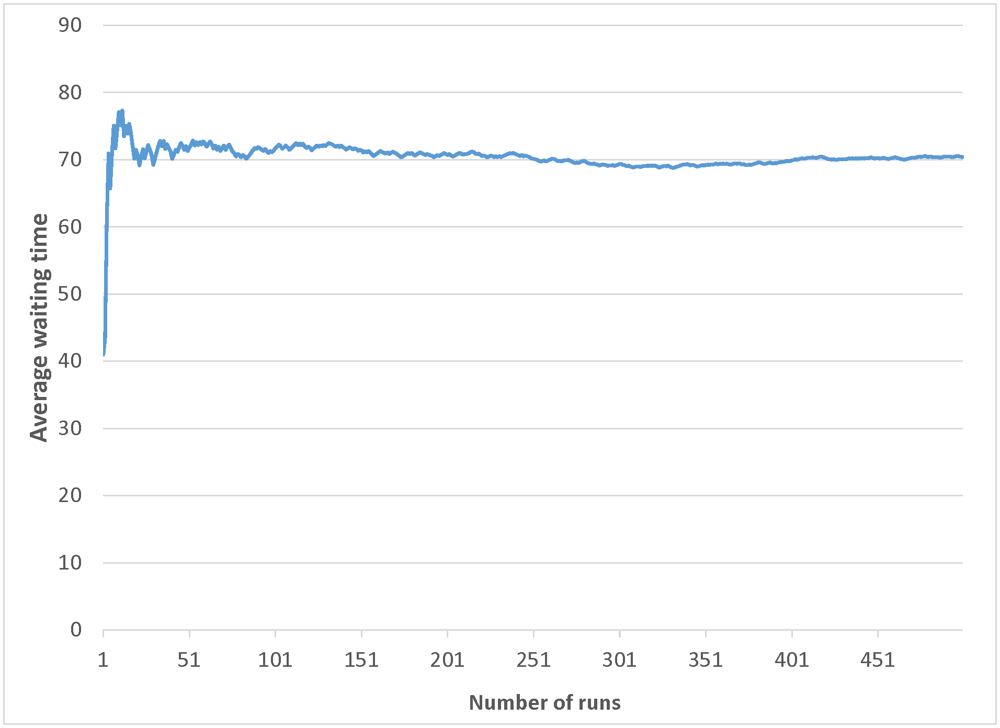

**Question 1:**

Number of potential buyers who tour a house but don't make an offer, until one offers to buy it.

-   [ ] Binomial

-   [ ] Exponential

-   [x] Geometric

-   [ ] Poisson

-   [ ] Weibull

Time between people entering a grocery store.

-   [ ] Binomial

-   [x] Exponential

-   [ ] Geometric

-   [ ] Poisson

-   [ ] Weibull

Time from when a house is put on the market until the first offer is received

-   [ ] Binomial

-   [ ] Exponential

-   [ ] Geometric

-   [ ] Poisson

-   [x] Weibull

Time from when a lightbulb is turned on until it blows out.

-   [ ] Binomial

-   [ ] Exponential

-   [ ] Geometric

-   [ ] Poisson

-   [x] Weibull

Time between arrivals to a flu-shot clinic.

-   [ ] Binomial

-   [x] Exponential

-   [ ] Geometric

-   [ ] Poisson

-   [ ] Weibull

------------------------------------------------------------------------

**Questions 2a, 2b**

Five classification models were built for predicting whether a neighborhood will soon see a large rise in home prices, based on public elementary school ratings and other factors. The training data set was missing the school rating variable for every new school (3% of the data points).

[Because ratings are unavailable for newly-opened schools, it is believed that locations that have recently experienced high population growth are more likely to have missing school rating data.]{.underline}

-   Model 1 used imputation, filling in the missing data with the average school rating from the rest of the data.
-   Model 2 used imputation, building a regression model to fill in the missing school rating data based on other variables.
-   Model 3 used imputation, first building a classification model to estimate (based on other variables) whether a new school is likely to have been built as a result of recent population growth (or whether it has been built for another purpose, e.g. to replace a very old school), and then using that classification to select one of two regression models to fill in an estimate of the school rating; there are two different regression models (based on other variables), one for neighborhoods with new schools built due to population growth, and one for neighborhoods with new schools built for other reasons.
-   Model 4 used a binary variable to identify locations with missing information.
-   Model 5 used a categorical variable: first, a classification model was used to estimate whether a new school is likely to have been built as a result of recent population growth; and then each neighborhood was categorized as "data available", "missing, population growth", or "missing, other reason".

**Question 2a:** If school ratings [cannot]{.underline} be reasonably well-predicted from the other factors, and new schools built due to recent population growth [cannot]{.underline} be reasonably well-classified using the other factors, which model would you recommend?

-   [ ] Model 1

-   [ ] Model 2

-   [ ] Model 3

-   [x] Model 4

-   [ ] Model 5

**Question 2b:** In which of the following situations would you recommend using Model 3? [All predictions and classifications below are using the other factors.]

-   [x] Ratings [can]{.underline} be well-predicted, and reasons for building schools [can]{.underline} be well-classified.

-   [ ] Ratings [can]{.underline} be well-predicted, and reasons for building schools [cannot]{.underline} be well-classified.

-   [ ] Ratings [cannot]{.underline} be well-predicted, and reasons for building schools [can]{.underline} be well-classified.

-   [ ] Ratings [cannot]{.underline} be well-predicted, and reasons for building schools [cannot]{.underline} be well-classified.

------------------------------------------------------------------------

**Question 3**

In a diet problem (like we saw in the lessons and homework), let $x_{i}$ be the amount of food i in the solution $(x_{i} \ge 0)$, and let $M$ be the maximum amount that can be eaten of any food.

Suppose we added new variables y~i~ that are binary (i.e., they must be either 0 or 1): if food i is eaten in the solution, then it is part of the solution $(y_{i} = 1)$; otherwise $y_{i} = 0$.

Select the mathematical constraint that corresponds to the following English sentence: If broccoli is eaten, then either cheese sauce or peanut butter (or both) must also be eaten.

-   [ ] $y_{peanutbutter} + y_{cheesesauce} = 0$

-   [ ] $y_{peanutbutter} = 1 - y_{cheesesauce}$

-   [x] $y_{broccoli} \le y_{cheesesauce} + y_{peanutbutter}$

-   [ ] $y_{broccoli} +y_{cheesesauce} + y_{peanutbutter} \le 2$

-   [ ] $x_{cheesesauce} \le My_{cheesesauce}$

-   [ ] $y_{cheesesauce} = 1$

-   [ ] $x_{broccoli} \le My_{peanutbutter}$

-   [ ] $x_{broccoli} \ge My_{peanutbutter}$

Select the mathematical constraint that corresponds to the following English sentence: If neither cheese sauce nor peanut butter is eaten, then broccoli can't be eaten either.

-   [ ] $y_{peanutbutter} + y_{cheesesauce} = 0$

-   [ ] $y_{peanutbutter} = 1 - y_{cheesesauce}$

-   [x] $y_{broccoli} \le y_{cheesesauce} + y_{peanutbutter}$

-   [ ] $y_{broccoli} +y_{cheesesauce} + y_{peanutbutter} \le 2$

-   [ ] $x_{cheesesauce} \le My_{cheesesauce}$

-   [ ] $y_{cheesesauce} = 1$

-   [ ] $x_{broccoli} \le My_{peanutbutter}$

-   [ ] $x_{broccoli} \ge My_{peanutbutter}$

Select the mathematical constraint that corresponds to the following English sentence: Broccoli, cheese sauce, and peanut butter all can't be eaten together.

-   [ ] $y_{peanutbutter} + y_{cheesesauce} = 0$

-   [ ] $y_{peanutbutter} = 1 - y_{cheesesauce}$

-   [ ] $y_{broccoli} \le y_{cheesesauce} + y_{peanutbutter}$

-   [x] $y_{broccoli} +y_{cheesesauce} + y_{peanutbutter} \le 2$

-   [ ] $x_{cheesesauce} \le My_{cheesesauce}$

-   [ ] $y_{cheesesauce} = 1$

-   [ ] $x_{broccoli} \le My_{peanutbutter}$

-   [ ] $x_{broccoli} \ge My_{peanutbutter}$

Select the mathematical constraint that corresponds to the following English sentence: Either cheese sauce or peanut butter (or both) must be eaten if broccoli is eaten.

-   [ ] $y_{peanutbutter} + y_{cheesesauce} = 0$

-   [ ] $y_{peanutbutter} = 1 - y_{cheesesauce}$

-   [x] $y_{broccoli} \le y_{cheesesauce} + y_{peanutbutter}$

-   [ ] $y_{broccoli} +y_{cheesesauce} + y_{peanutbutter} \le 2$

-   [ ] $x_{cheesesauce} \le My_{cheesesauce}$

-   [ ] $y_{cheesesauce} = 1$

-   [ ] $x_{broccoli} \le My_{peanutbutter}$

-   [ ] $x_{broccoli} \ge My_{peanutbutter}$

Select the mathematical constraint that corresponds to the following English sentence: No more than two of broccoli, cheese sauce, and peanut butter may be eaten.

-   [ ] $y_{peanutbutter} + y_{cheesesauce} = 0$

-   [ ] $y_{peanutbutter} = 1 - y_{cheesesauce}$

-   [ ] $y_{broccoli} \le y_{cheesesauce} + y_{peanutbutter}$

-   [x] $y_{broccoli} +y_{cheesesauce} + y_{peanutbutter} \le 2$

-   [ ] $x_{cheesesauce} \le My_{cheesesauce}$

-   [ ] $y_{cheesesauce} = 1$

-   [ ] $x_{broccoli} \le My_{peanutbutter}$

-   [ ] $x_{broccoli} \ge My_{peanutbutter}$

------------------------------------------------------------------------

**Question 4a**

A large company's internal IT helpdesk has created a stochastic discrete-event simulation model of its operations, including help-request arrivals, routing of requests to the appropriate staff member, and the amount of time needed to give assistance.

The helpdesk is not first-come-first-served. A more-important problem (like the spread of serious malware to many company computers) will be dealt with ahead of a less-important problem (like a ripped mouse pad), and a higher-level employee (like the CEO) might be helped ahead of a lower-level employee (like a worker in the mailroom).

When a new request for help comes in, the helpdesk will run the simulation to quickly give the requester an estimate of the expected wait time before being helped.

How many times does the company need to run the simulation for each new help request (i.e., how many replications are needed)?

-   [ ] Once, because the outcome will be the same each time

-   [ ] Many times, because of the variability and randomness

-   [ ] Once, because each patient is unique

**Information for Question 4b**



The figure above shows the average of the first *x* simulated wait times, as new replications ("runs") are run and added into the overall average.  It is not showing the wait time just for each replication.  For example, after *x*=101 replications, the wait time of the 101st replication is not necessarily 72, but the average of those 101 replications is about 72.

**Question 4b:** If the goal is to report the expected wait time to within +/- 2 minutes, what can you conclude from the figure above? Select [all]{.underline} of the answers that are correct.

-   [x] The simulation could have been stopped after 400 runs (replications).

-   [ ] The simulation could even have been stopped after 5 runs (replications).

-   [ ] The simulated wait time was 50 or less just once out of all the runs (replications).

-   [ ] The expected wait time of simulated runs (replications) is likely to be between 75 and 85.

-   [ ] There is very little variability in the simulated wait time of the runs (replications).

**Question 4c:** Suppose it is discovered that simulated wait times are 25% lower than actual wait times, on average. What would you recommend that they do?

-   [ ] Scale up all estimates by a factor of 1/0.75 to get the average simulation estimates to match the average actual wait times.

-   [x] Investigate to see what's wrong with the simulation, because it's a poor match to reality.

-   [ ] Use the 25%-lower estimates, because that's what the simulation output is.

------------------------------------------------------------------------

**Question 5**

Maximize $\sum_{i} c_{i}x_{i}$

subject to $\sum_{i} \sum_{k} a_{ikj}x_{i}x_{k} \le b_{j}$ for all $j$

all $x_{i} \ge 0$

-   [ ] Convex program

-   [ ] Convex quadratic program

-   [x] General non-convex program

-   [ ] Integer program

-   [ ] Linear program

Minimize $\sum_{i} c_{i}x_{i}^2$

subject to $\sum_{i} a_{ij}x_{i} \ge b_{j}$ for all $j$

all $x_{i} \ge 0$

-   [ ] Convex program

-   [x] Convex quadratic program

-   [ ] General non-convex program

-   [ ] Integer program

-   [ ] Linear program

Minimize $\sum_{i} c_{i} |x_{i} - 6|$

subject to $\sum_{i} a_{ij}x_{i} \ge b_{j}$ for all $j$

all $x_{i} \ge 0$

-   [x] Convex program

-   [ ] Convex quadratic program

-   [ ] General non-convex program

-   [ ] Integer program

-   [ ] Linear program

Minimize $\sum_{i} (log c_{i})x_{i}$

subject to $\sum_{i} a_{ij}x_{i} \ge b_{j}$ for all $j$

all $x_{i} \ge 0$

-   [ ] Convex program

-   [ ] Convex quadratic program

-   [ ] General non-convex program

-   [ ] Integer program

-   [x] Linear program

Minimize $\sum_{i} c_{i} sin x_{i}$

subject to $\sum_{i} a_{ij}x_{i} \ge b_{j}$ for all $j$

all $x_{i} \ge 0$

-   [ ] Convex program

-   [ ] Convex quadratic program

-   [x] General non-convex program

-   [ ] Integer program

-   [ ] Linear program

Maximize $\sum_{i} c_{i}x_{i}$

subject to $\sum_{i} a_{ij}x_{i} \ge b_{j}$ for all $j$

all $x_{i} \in {0, 1}$

-   [ ] Convex program

-   [ ] Convex quadratic program

-   [ ] General non-convex program

-   [x] Integer program

-   [ ] Linear program

Maximize $\sum_{i} c_{i}x_{i}$

subject to $\sum_{i} a_{ij}x_{i} \ge b_{j}$ for all $j$

all $x_{i} \ge 0$

-   [ ] Convex program

-   [ ] Convex quadratic program

-   [ ] General non-convex program

-   [ ] Integer program

-   [x] Linear program

------------------------------------------------------------------------

**Question 6a, 6b, 6c**

A supermarket is analyzing its checkout lines, to determine how many checkout lines to have open at each time.

At busy times (about 10% of the times), the arrival rate is 5 shoppers/minute. At other times, the arrival rate is 2 shoppers/minute. Once a shopper starts checking out (at any time), it takes an average of 3 minutes to complete the checkout.

[NOTE: This is a simplified version of the checkout system. If you have deeper knowledge of how supermarket checkout systems work, please do not use it for this question; you would end up making the question more complex than it is designed to be.]

**Question 6a:** The first model the supermarket tries is a queuing model with 20 lines open at all times. What would you expect the queuing model to show?

-   [x] Wait times are low at both busy and non-busy times.

-   [ ] Wait times are low at busy times and high at non-busy times.

-   [ ] Wait times are low at non-busy times and high at busy times.

-   [ ] Wait times are high at both busy and non-busy times.

**Question 6b:** The second model the supermarket tries is a queuing model with 10 lines open during busy times and 4 lines open during non-busy times. What would you expect the queuing model to show?

-   [ ] Wait times are low at both busy and non-busy times.

-   [ ] Wait times are low at busy times and high at non-busy times.

-   [ ] Wait times are low at non-busy times and high at busy times.

-   [x] Wait times are high at both busy and non-busy times.

The supermarket now has decided that, when there are 5 people waiting (across all lines), the supermarket will open an express checkout line, which stays open until nobody is left waiting.

The supermarket would like to model this new process with a Markov chain, where each state is the number of people waiting (e.g., 0 people waiting, 1 person waiting, etc.).

Notice that now, the transition probabilities from a state like "3 people waiting" depend on how many lines are currently open, and therefore depend on whether the system was more recently in the state "5 people waiting" or "0 people waiting".

**Question 6c:** Which of the following statements about the process (the checkout system) and its relation to the Markov chain's memoryless property (previous states don't affect the probability of moving from one state to another) is true?

-   [ ] The process is memoryless, so the Markov chain is an appropriate model.

-   [ ] The process is memoryless and the Markov chain is an appropriate model [only]{.underline} if the arrivals follow the Poisson distribution and the checkout times follow the Exponential distribution.

-   [x] The process is not memoryless, so the Markov chain model would not be not well-defined.

------------------------------------------------------------------------

**Questions 7a, 7b**

A retailer is testing two different customer retention approaches. The retailer is using A/B testing: For each customer, the retailer randomly selects one approach or the other to use. The results after 2000 trials are shown below.

|          | Trials | Customer loss rate | 95% confidence interval |
|----------|--------|--------------------|-------------------------|
| Option A | 1036   | 4.8%               | 3.6%-6.2%               |
| Option B | 964    | 5.2%               | 3.8%-6.6%               |

Note: [The "customer loss rate" is the fraction of customers who stop doing business with the retailer. Lower customer loss rates are better]{.underline}.

**Question 7a:** What should the retailer do?

-   [ ] Switch to exploitation (utilize Option A only; A is clearly better)

-   [ ] Switch to exploitation (utilize Option B only; B is clearly better)

-   [x] More exploration (test both options; it is unclear yet which is better)

Later, the retailer developed 7 new options, so they used a multi-armed bandit approach where each option is chosen with probability proportional to its likelihood of being the best. The results after 2000 total trials are shown below.

|           | Customer loss rate | Average customer order value | Median customer order value |
|:----------|:-------------------|:-----------------------------|:----------------------------|
| Option #1 | 3.2%               | \$112                        | \$100                       |
| Option #2 | 4.2%               | \$98                         | \$75                        |
| Option #3 | 5.2%               | \$174                        | \$125                       |
| Option #4 | 5.5%               | \$153                        | \$100                       |
| Option #5 | 6.5%               | \$122                        | \$80                        |
| Option #6 | 10.8%              | \$132                        | \$100                       |
| Option #7 | 15.0%              | \$106                        | \$75                        |

**Question 7b:** If the retailer's main goal is to find the option that has the highest average customer order value, which type of tests should they use to see if the option that appears best is significantly better than each of the other options?

-   [ ] Binomial-based (e.g., McNemar's) tests

-   [ ] Other non-parametric tests

-   [x] Parametric tests

------------------------------------------------------------------------

**Information for Question 8a**

For each of the mathematical optimization models, select the variable-selection/regularization method it most-precisely represents (or select "none of the above" if none of the other choices are appropriate).  In each model, $x$ is the data, $y$ is the response, $a$ are the coefficients, $n$ is the number of data points, $m$ is the number of predictors, and $T$ and $\lambda$ are appropriate constants.

**Question 8a**

Minimize $\sum_{i=1}^n (y_{i} -(a_{0} + \sum_{j=1}^m a_{j}x_{ij})^2$

subject to $\lambda \sum_{j=1} ^m |a_{j}| + (1-\lambda) \sum_{j=1} ^m (a_{j})^2 \le T$

-   [x] Elastic Net

-   [ ] Lasso Regression

-   [ ] Ridge Regression

-   [ ] None of the Above

Minimize $\sum_{i=1}^n (y_{i} -(a_{0} + \sum_{j=1}^m a_{j}x_{ij})^2$

subject to $\sum_{j=1} ^m (a_j)^2 \le T$

-   [ ] Elastic Net

```{=html}
<!-- -->
```
-   [ ] Lasso Regression

-   [x] Ridge Regression

-   [ ] None of the Above

Minimize $\sum_{i=1}^n (y_{i} -(a_{0} + \sum_{j=1}^m a_{j}x_{ij})^2$

-   [ ] Elastic Net

-   [ ] Lasso Regression

-   [ ] Ridge Regression

-   [x] None of the Above

Minimize $\sum_{i=1}^n (y_{i} -(a_{0} + \sum_{j=1}^m a_{j}x_{ij})^2$

subject to $\sum_{j=1} ^m |a_{j}| \le T$

-   [ ] Elastic Net

-   [x] Lasso Regression

-   [ ] Ridge Regression

-   [ ] None of the Above

**Question 8b:** Rank the following regression and variable-selection/regularization methods from fewest variables selected to most variables selected. All four methods will be used (the bottom contains two equivalent spaces).

Fewest to Most variables selected:

-   Lasso Regression

-   Elastic Net

-   Linear Regression, Ridge Regression

**Question 8c:** Select all of the following reasons that you might want to use stepwise regression, lasso, etc. to limit the number of factors in a model.

-   [x] To find a simpler model

-   [x] Because there isn't enough data to avoid overfitting a model with many factors

-   [ ] To find a more-complex model

**Question 8d:** In the simple linear regression model $minimize \sum_{i=1} ^n (y_{i}-(a_{0}+\sum_{j=1} ^m a_{j}x_{ij}))^2$

**Question 8d i.:** What are the variables from a [regression]{.underline} perspective?

-   [x] Only $x_{ij}$

-   [ ] Both $x_{ij}$ and $a_{j}$

-   [ ] Both $x_{ij}$ and $y_{i}$

-   [ ] Only $a_{j}$

-   [ ] Only $y_{i}$

**Question 8d ii.:** What are the variables from an [optimization]{.underline} perspective?

-   [ ] Only $y_{i}$

-   [ ] Both $x_{ij}$ and $a_{j}$

-   [x] Only $a_{j}$

-   [ ] Both $x_{ij}$ and $y_{i}$

-   [ ] Only $x_{ij}$

**Question 8e:** Put the following seven steps in order, from what is done first to what is done last.

1.  Remove outliers
2.  Impute missing data
3.  Scale Data
4.  Fit lasso regression model on all variables
5.  Fit linear regression, regression tree, and random forest models using variables chosen by lasso regression
6.  Pick model to use based on performance on a different data set
7.  Test model on another different set of data to estimate quality

------------------------------------------------------------------------

**Question 9**

What is the best route for a delivery vehicle to take, given uncertainties in upcoming traffic?

-   [ ] Game theoretic analysis

-   [ ] Louvain algorithm

-   [ ] Non-parametric test

-   [ ] Queuing

-   [x] Stochastic Optimization

Nobody knows exactly how investments will change in value. What's the best set to invest in?

-   [ ] Game theoretic analysis

-   [ ] Louvain algorithm

-   [ ] Non-parametric test

-   [ ] Queuing

-   [x] Stochastic Optimization

How many servers are needed so database users don't need to wait too long for query processing?

-   [ ] Game theoretic analysis

-   [ ] Louvain algorithm

-   [ ] Non-parametric test

-   [x] Queuing

-   [ ] Stochastic Optimization

Estimate the number of workers required to work at a call center based on call arrivals and lengths.

-   [ ] Game theoretic analysis

-   [ ] Louvain algorithm

-   [ ] Non-parametric test

-   [x] Queuing

-   [ ] Stochastic Optimization

Find the best airline flight schedule given uncertain weather-related delays and maintenance delays.

-   [ ] Game theoretic analysis

-   [ ] Louvain algorithm

-   [ ] Non-parametric test

-   [ ] Queuing

-   [x] Stochastic Optimization
